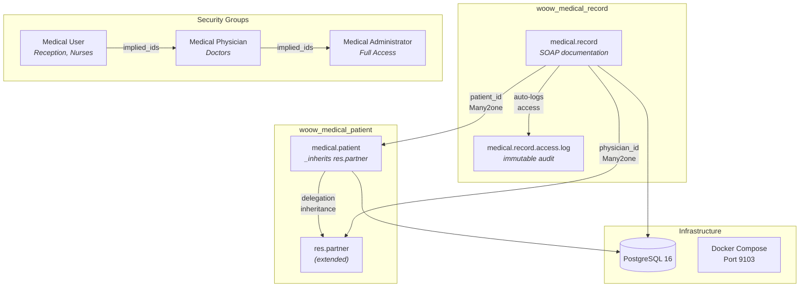
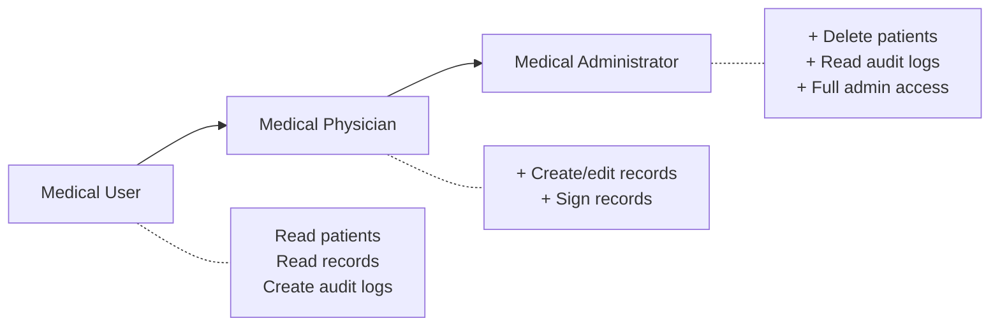

<p align="center">
  
</p>

<h1 align="center">Woow Medical Clinic Package</h1>

<p align="center">
  <strong>A comprehensive medical clinic management system for Odoo 18 Community Edition</strong><br>
  Patient management &middot; SOAP medical records &middot; Role-based access control &middot; Audit logging
</p>

<p align="center">
  
  
  
  
  
</p>

<p align="center">
  <strong>English</strong> | <a href="README_zh-TW.md">繁體中文</a>
</p>

---

## Table of Contents

- [Overview](#overview)
- [Key Features](#key-features)
- [Architecture](#architecture)
- [Module Details](#module-details)
- [Screenshots](#screenshots)
- [Quick Start](#quick-start)
- [Installation](#installation)
- [Configuration](#configuration)
- [Security Model](#security-model)
- [Testing](#testing)
- [Internationalization](#internationalization)
- [Changelog](#changelog)
- [Support](#support)
- [License](#license)

---

## Overview

**Woow Medical Clinic Package** is a two-module system built on Odoo 18 Community Edition, designed for aesthetic and medical clinic management. It provides complete patient lifecycle management and SOAP-based medical record documentation.

The package follows Odoo best practices with delegation inheritance, multi-company isolation, immutable audit logging, and a layered security model with three hierarchical roles plus an independent PII access group.

Both modules include complete Traditional Chinese (zh_TW) translations, enabling bilingual clinic operations out of the box.

---

## Key Features

### woow_medical_patient — Patient Management

| Feature | Description |
|---------|-------------|
| Auto-Generated Patient Numbers | Sequential numbering (P000001, P000002...) via `ir.sequence` |
| Delegation Inheritance | Extends `res.partner` — shares name, phone, email, image, address |
| PII Field Protection | National ID and NHI card number fields gated by dedicated security group |
| Medical History Tracking | Allergies, chronic diseases, medication history, surgery history |
| Emergency Contact | Contact name, phone, and relationship |
| Multi-Company Isolation | Global record rule per company |
| Kanban, List & Form Views | Employee-style kanban with avatar; full form with tabbed notebook |
| Traditional Chinese (zh_TW) | Complete translation of all labels, menus, and messages |

### woow_medical_record — Medical Record Management

| Feature | Description |
|---------|-------------|
| SOAP Documentation | Subjective, Objective, Assessment, Plan — each as rich-text HTML fields |
| Vital Signs Tracking | Height, weight, blood pressure (systolic/diastolic), pulse, temperature |
| Daily Auto-Numbering | Format `YYYYMMDD-001` with daily reset using `ir.sequence.date_range` |
| Three-State Workflow | Draft → In Progress → Signed, with workflow button validation |
| Signing Validation | At least one SOAP field must be filled before signing is allowed |
| Immutable Audit Log | Every view, sign, and unsign action logged; logs cannot be modified or deleted |
| File Attachments | Before/after photos, lab reports via `many2many_binary` widget |
| Calendar & Pivot Views | Calendar colored by physician; pivot analysis by physician vs. month |
| Patient Stat Button | Record count button on patient form with embedded record list tab |

---

## Architecture

### System Overview (ASCII)

```
┌──────────────────────────────────────────────────────────────┐
│                     Odoo 18 Web Client                       │
├──────────────────────────────────────────────────────────────┤
│                       Medical Menu                           │
│  ┌─────────────────────┐    ┌────────────────────────────┐   │
│  │      Patients        │    │     Medical Records         │   │
│  │  · Patient List      │    │  · All Records              │   │
│  │  · Patient Form      │    │  · My Records               │   │
│  │  · Kanban View       │    │  · Calendar / Pivot         │   │
│  └──────────┬──────────┘    └────────────┬───────────────┘   │
│             │                            │                    │
│  ┌──────────▼──────────┐    ┌────────────▼───────────────┐   │
│  │ woow_medical_patient │◄───│ woow_medical_record        │   │
│  │                      │    │                            │   │
│  │ · medical.patient    │    │ · medical.record           │   │
│  │ · res.partner (ext)  │    │ · medical.record.access.log│   │
│  └──────────┬──────────┘    └────────────┬───────────────┘   │
│             │                            │                    │
├─────────────▼────────────────────────────▼────────────────────┤
│                     Security Layer                            │
│  Medical User → Medical Physician → Medical Administrator     │
│  Multi-Company Record Rules  │  Immutable Audit Logging       │
├──────────────────────────────────────────────────────────────┤
│            PostgreSQL 16  │  Docker Compose                   │
└──────────────────────────────────────────────────────────────┘
```

### Module Relationships (Mermaid)



### Security Group Hierarchy (Mermaid)



---

## Module Details

### woow_medical_patient (v18.0.1.0.0)

| Property | Value |
|----------|-------|
| Technical Name | `woow_medical_patient` |
| Application | Yes |
| Dependencies | `base`, `contacts`, `mail` |
| License | LGPL-3 |
| Models | `medical.patient`, `res.partner` (extension) |

**Key Fields:**

| Field | Type | Description |
|-------|------|-------------|
| `medical_no` | Char | Auto-generated patient number (P000001) |
| `national_id` | Char | National ID number (PII protected) |
| `nhi_card_no` | Char | NHI card number (PII protected) |
| `date_of_birth` | Date | Date of birth |
| `age` | Integer | Computed age |
| `gender` | Selection | Male / Female / Other |
| `blood_type` | Selection | A / B / O / AB |
| `allergy` | Text | Allergy information |
| `chronic_disease` | Text | Chronic disease history |
| `medication_history` | Text | Current medications |
| `surgery_history` | Text | Past surgeries |
| `emergency_contact` | Char | Emergency contact name |
| `emergency_phone` | Char | Emergency contact phone |
| `emergency_relationship` | Char | Relationship to patient |

### woow_medical_record (v18.0.1.0.0)

| Property | Value |
|----------|-------|
| Technical Name | `woow_medical_record` |
| Application | No |
| Dependencies | `woow_medical_patient`, `mail` |
| License | LGPL-3 |
| Models | `medical.record`, `medical.record.access.log`, `medical.patient` (extension) |

**Key Fields:**

| Field | Type | Description |
|-------|------|-------------|
| `name` | Char | Auto-generated record number (YYYYMMDD-001) |
| `patient_id` | Many2one | Link to patient |
| `physician_id` | Many2one | Attending physician |
| `visit_datetime` | Datetime | Visit date and time |
| `state` | Selection | draft / in_progress / signed |
| `subjective` | Html | S — Chief complaint and symptoms |
| `objective` | Html | O — Examination findings |
| `assessment` | Html | A — Diagnosis and assessment |
| `plan` | Html | P — Treatment plan |
| `height` | Float | Height (cm) |
| `weight` | Float | Weight (kg) |
| `systolic_bp` | Integer | Systolic blood pressure |
| `diastolic_bp` | Integer | Diastolic blood pressure |
| `pulse` | Integer | Pulse (bpm) |
| `temperature` | Float | Temperature (°C) |
| `attachment_ids` | Many2many | File attachments |

---

## Screenshots

### Patient List View

*List view showing auto-generated patient numbers, names, phone numbers, gender, age, last visit date, and record count.*

### Patient Kanban View

*Kanban cards displaying patient avatars, names, medical numbers, and contact information.*

### Patient Form — Basic Information

*Patient form with contact info, identification (PII) fields, personal data tab with birthday, gender, blood type, and emergency contact section.*

### Patient Form — Medical History

*Medical history tab showing allergies, chronic diseases, medication history, and surgery history fields.*

### Patient Form — Records & Stat Button

*Patient form showing the Medical Records tab with embedded record list and stat buttons in the header.*

### Medical Record List View

*Medical record list with record numbers, patient names, physicians, visit dates, and color-coded status indicators.*

### Medical Record Form — SOAP

*Medical record form showing SOAP tabs (S/O/A/P), three-state workflow bar (Draft → In Progress → Signed), and the chatter.*

### Medical Record Form — Vital Signs

*Objective (O) tab with vital signs fields: height, weight, blood pressure, pulse, and temperature.*

### Medical Record Calendar View

*Calendar view showing medical records as events, useful for scheduling and appointment overview.*

### Settings — Access Rights

*User form in Settings showing the Medical permission dropdown under the Access Rights tab.*

### Home Menu

*Odoo home menu showing the Medical application tile alongside other installed apps.*

### Module Icon


### Audit Log

*Immutable access log recording every view, sign, and unsign action on medical records.*

---

## Quick Start

### Prerequisites

- Docker & Docker Compose
- Git

### Steps

```bash
# 1. Clone the repository
git clone https://github.com/WOOWTECH/Woow_odoo_clinic_package.git
cd Woow_odoo_clinic_package

# 2. Start the services
docker compose up -d

# 3. Access Odoo
#    URL:      http://localhost:9103
#    Login:    admin
#    Password: admin

# 4. Install modules via the Odoo Apps menu:
#    - Search for "Medical" or "Woow"
#    - Install "Woow 醫療 - 病患管理" first
#    - Then install "Woow 醫療 - 病歷管理"
```

---

## Installation

### Manual Installation (without Docker)

1. Copy `woow_medical_patient` and `woow_medical_record` to your Odoo addons path
2. Restart the Odoo server
3. Navigate to **Apps** → **Update Apps List**
4. Search for "Woow" and install **Woow 醫療 - 病患管理** first
5. Then install **Woow 醫療 - 病歷管理**

> **Note:** `woow_medical_record` depends on `woow_medical_patient` — install the patient module first.

### Docker Environment Details

| Service | Image | Port | Credentials |
|---------|-------|------|-------------|
| PostgreSQL | postgres:16 | 5432 (internal) | `odooclinic` / `odooclinic` |
| Odoo 18 | odoo:18 | 9103 → 8069 | `admin` / `admin` |

---

## Configuration

### Database

The default Docker setup uses:
- **Database name:** `odoo-clinic`
- **Database user:** `odooclinic`
- **Configuration file:** `config/odoo.conf`

### Multi-Company

Both modules support multi-company isolation. Each company's data is automatically separated via global record rules. To enable multi-company:

1. Go to **Settings** → **General Settings** → enable **Multi-Companies**
2. Create additional companies
3. Assign users to their respective companies

### User Group Assignment

1. Go to **Settings** → **Users & Companies** → **Users**
2. Select a user and open the **Access Rights** tab
3. Scroll to the **OTHER** section
4. Set the **Medical** dropdown to the appropriate role:
   - **Medical User** — Reception staff, nurses (read patients, read records)
   - **Medical Physician** — Doctors (create/edit records, sign records)
   - **Medical Administrator** — Full access including audit logs

---

## Security Model

### Permission Matrix

| Group | Patients | Medical Records | Access Logs |
|-------|----------|-----------------|-------------|
| Medical User | Read, Write, Create | Read only | Create only |
| Medical Physician | Read, Write, Create | Read, Write, Create | Create only |
| Medical Administrator | Read, Write, Create, Delete | Read, Write, Create | Read, Create |

### Record Rules

| Rule | Scope | Description |
|------|-------|-------------|
| Physician Own Records | `medical.record` | Physicians can only see their own medical records |
| Admin All Records | `medical.record` | Administrators can see all records within their company |
| Multi-Company Isolation | Global | Records are isolated per company |

### PII Protection

National ID (`national_id`) and NHI card number (`nhi_card_no`) fields are sensitive personally identifiable information. Access to these fields is controlled through the security model to ensure only authorized users can view patient identity documents.

---

## Testing

The project includes a comprehensive multi-layer test suite:

| Layer | File | Focus |
|-------|------|-------|
| Layer 1 | `tests/layer1_api.py` | API/Backend — JSON-RPC CRUD operations |
| Layer 2 | `tests/layer2_e2e.js` | E2E — Browser-based workflow testing |
| Layer 3 | `tests/layer3_negative.py` | Negative — Error paths and security boundaries |
| Layer 4 | `tests/layer4_performance.py` | Performance — Load and stress testing |
| Layer 5 | `tests/layer5_integrity.py` | Integrity — Data consistency and constraints |
| E2E Permissions | `tests/e2e-permissions/` | Playwright — Access rights dropdown, PII visibility, permission escalation |
| Acceptance | `test_acceptance.py` | Smoke test — End-to-end acceptance verification |

### Running Tests

```bash
# Run all test layers
python3 tests/run_all.py

# Run a specific layer
python3 tests/layer1_api.py

# Run acceptance test
python3 test_acceptance.py

# Run Playwright permission tests
cd tests/e2e-permissions
npm install
npx playwright test
```

---

## Internationalization

Both modules include complete Traditional Chinese (zh_TW) translations:

- **woow_medical_patient:** `i18n/zh_TW.po`
- **woow_medical_record:** `i18n/zh_TW.po`

To enable Chinese:

1. Go to **Settings** → **General Settings** → **Languages**
2. Add **Chinese (Traditional)** if not already available
3. Each user can set their preferred language in **Preferences**

All labels, menus, field names, tooltips, and messages are translated. Technical terms and code remain in English.

---

## Changelog

### v18.0.1.0.0 (2025-05)

- Initial release
- Patient management with auto-numbering and delegation inheritance from `res.partner`
- SOAP medical records with daily numbering and three-state workflow
- Immutable access audit logging
- Role-based access control (3 hierarchical groups + PII protection)
- Multi-company support with global record rules
- Traditional Chinese (zh_TW) complete translation
- Docker Compose deployment (PostgreSQL 16 + Odoo 18)
- Multi-layer automated test suite (5 layers + Playwright E2E)

---

## Support

- **Website:** [https://www.woowtech.io](https://www.woowtech.io)
- **Issues:** [https://github.com/WOOWTECH/Woow_odoo_clinic_package/issues](https://github.com/WOOWTECH/Woow_odoo_clinic_package/issues)
- **Author:** WoowTech

---

## License

This project is licensed under the [LGPL-3.0](https://www.gnu.org/licenses/lgpl-3.0.html).

Copyright &copy; 2025 WoowTech
