<p align="center">
  
</p>

<h1 align="center">Woow 醫療診所套件</h1>

<p align="center">
  <strong>基於 Odoo 18 社群版的完整醫療診所管理系統</strong><br>
  病患管理 &middot; SOAP 病歷紀錄 &middot; 角色權限控管 &middot; 存取稽核日誌
</p>

<p align="center">
  
  
  
  
  
</p>

<p align="center">
  <a href="README.md">English</a> | <strong>繁體中文</strong>
</p>

---

## 目錄

- [總覽](#總覽)
- [主要功能](#主要功能)
- [系統架構](#系統架構)
- [模組詳情](#模組詳情)
- [畫面截圖](#畫面截圖)
- [快速開始](#快速開始)
- [安裝方式](#安裝方式)
- [系統設定](#系統設定)
- [安全模型](#安全模型)
- [測試](#測試)
- [國際化](#國際化)
- [更新日誌](#更新日誌)
- [技術支援](#技術支援)
- [授權條款](#授權條款)

---

## 總覽

**Woow 醫療診所套件** 是一套基於 Odoo 18 社群版的雙模組系統，專為醫美診所及一般醫療診所設計，提供完整的病患生命週期管理與 SOAP 標準病歷文件記錄。

本套件遵循 Odoo 最佳實踐，採用委派繼承（delegation inheritance）、多公司隔離、不可變更的稽核日誌，以及三層式階層安全模型加上獨立的個資存取群組。

兩個模組均包含完整的繁體中文（zh_TW）翻譯，支援雙語診所環境。

---

## 主要功能

### woow_medical_patient — 病患管理

| 功能 | 說明 |
|------|------|
| 自動產生病患編號 | 序列編號（P000001, P000002...），使用 `ir.sequence` |
| 委派繼承 | 繼承 `res.partner`，共用姓名、電話、Email、頭像、地址 |
| 個資欄位保護 | 身分證字號與健保卡號受專用安全群組控管 |
| 病史追蹤 | 過敏、慢性病、用藥史、手術史 |
| 緊急聯絡人 | 聯絡人姓名、電話、與病患之關係 |
| 多公司隔離 | 全域記錄規則依公司隔離 |
| 看板、列表、表單視圖 | 員工風格看板含頭像；完整表單含分頁 |
| 繁體中文（zh_TW） | 所有標籤、選單、訊息完整翻譯 |

### woow_medical_record — 病歷管理

| 功能 | 說明 |
|------|------|
| SOAP 病歷文件 | 主訴（S）、客觀（O）、評估（A）、計畫（P），各為 HTML 富文字欄位 |
| 生命徵象記錄 | 身高、體重、血壓（收縮壓/舒張壓）、脈搏、體溫 |
| 每日自動編號 | 格式 `YYYYMMDD-001`，每日重置，使用 `ir.sequence.date_range` |
| 三階段工作流程 | 草稿 → 進行中 → 已簽核，含工作流程按鈕驗證 |
| 簽核驗證 | 至少填寫一個 SOAP 欄位才允許簽核 |
| 不可變更稽核日誌 | 每次檢視、簽核、取消簽核均記錄；日誌不可修改或刪除 |
| 檔案附件 | 術前/術後照片、檢驗報告，使用 `many2many_binary` 小工具 |
| 日曆與樞紐分析視圖 | 日曆依醫師著色；樞紐分析依醫師與月份交叉分析 |
| 病患統計按鈕 | 病患表單上的病歷數量按鈕，含嵌入式病歷列表分頁 |

---

## 系統架構

### 系統總覽（ASCII）

```
┌──────────────────────────────────────────────────────────────┐
│                     Odoo 18 網頁客戶端                        │
├──────────────────────────────────────────────────────────────┤
│                       醫療管理選單                             │
│  ┌─────────────────────┐    ┌────────────────────────────┐   │
│  │      病患管理         │    │       病歷管理               │   │
│  │  · 病患列表           │    │  · 所有病歷                 │   │
│  │  · 病患表單           │    │  · 我的病歷                 │   │
│  │  · 看板視圖           │    │  · 日曆 / 樞紐分析          │   │
│  └──────────┬──────────┘    └────────────┬───────────────┘   │
│             │                            │                    │
│  ┌──────────▼──────────┐    ┌────────────▼───────────────┐   │
│  │ woow_medical_patient │◄───│ woow_medical_record        │   │
│  │                      │    │                            │   │
│  │ · medical.patient    │    │ · medical.record           │   │
│  │ · res.partner（擴充） │    │ · medical.record.access.log│   │
│  └──────────┬──────────┘    └────────────┬───────────────┘   │
│             │                            │                    │
├─────────────▼────────────────────────────▼────────────────────┤
│                       安全層                                  │
│  醫療使用者 → 醫療醫師 → 醫療管理者                              │
│  多公司記錄規則  │  不可變更稽核日誌                              │
├──────────────────────────────────────────────────────────────┤
│            PostgreSQL 16  │  Docker Compose                   │
└──────────────────────────────────────────────────────────────┘
```

### 模組關係圖（Mermaid）

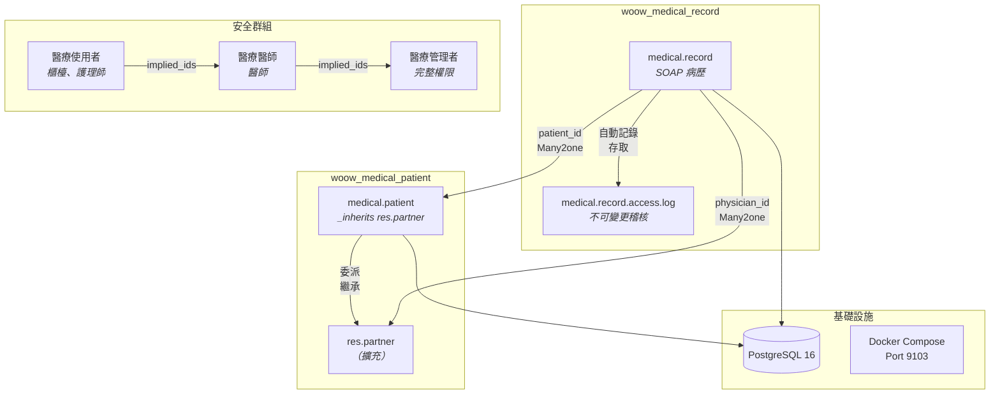

### 安全群組階層（Mermaid）

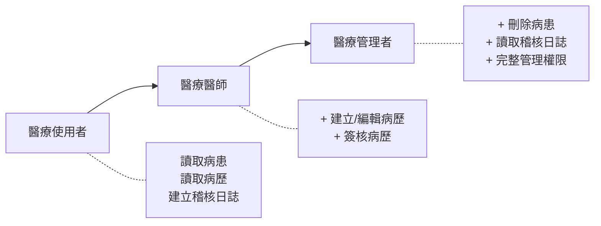

---

## 模組詳情

### woow_medical_patient (v18.0.1.0.0)

| 屬性 | 值 |
|------|-----|
| 技術名稱 | `woow_medical_patient` |
| 應用程式 | 是 |
| 相依模組 | `base`, `contacts`, `mail` |
| 授權 | LGPL-3 |
| 模型 | `medical.patient`, `res.partner`（擴充） |

**主要欄位：**

| 欄位 | 類型 | 說明 |
|------|------|------|
| `medical_no` | Char | 自動產生的病患編號（P000001） |
| `national_id` | Char | 身分證字號（個資保護） |
| `nhi_card_no` | Char | 健保卡號（個資保護） |
| `date_of_birth` | Date | 出生日期 |
| `age` | Integer | 計算年齡 |
| `gender` | Selection | 男 / 女 / 其他 |
| `blood_type` | Selection | A / B / O / AB |
| `allergy` | Text | 過敏資訊 |
| `chronic_disease` | Text | 慢性病史 |
| `medication_history` | Text | 用藥史 |
| `surgery_history` | Text | 手術史 |
| `emergency_contact` | Char | 緊急聯絡人姓名 |
| `emergency_phone` | Char | 緊急聯絡人電話 |
| `emergency_relationship` | Char | 與病患之關係 |

### woow_medical_record (v18.0.1.0.0)

| 屬性 | 值 |
|------|-----|
| 技術名稱 | `woow_medical_record` |
| 應用程式 | 否 |
| 相依模組 | `woow_medical_patient`, `mail` |
| 授權 | LGPL-3 |
| 模型 | `medical.record`, `medical.record.access.log`, `medical.patient`（擴充） |

**主要欄位：**

| 欄位 | 類型 | 說明 |
|------|------|------|
| `name` | Char | 自動產生的病歷編號（YYYYMMDD-001） |
| `patient_id` | Many2one | 關聯病患 |
| `physician_id` | Many2one | 主治醫師 |
| `visit_datetime` | Datetime | 就診日期時間 |
| `state` | Selection | draft / in_progress / signed |
| `subjective` | Html | S — 主訴與主觀症狀 |
| `objective` | Html | O — 客觀檢查結果 |
| `assessment` | Html | A — 診斷與評估 |
| `plan` | Html | P — 治療計畫 |
| `height` | Float | 身高（cm） |
| `weight` | Float | 體重（kg） |
| `systolic_bp` | Integer | 收縮壓 |
| `diastolic_bp` | Integer | 舒張壓 |
| `pulse` | Integer | 脈搏（bpm） |
| `temperature` | Float | 體溫（°C） |
| `attachment_ids` | Many2many | 檔案附件 |

---

## 畫面截圖

### 病患列表視圖
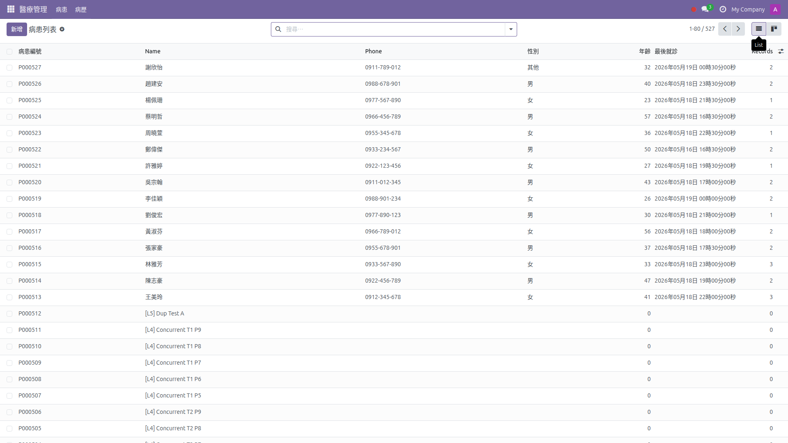
*列表視圖顯示自動產生的病患編號、姓名、電話、性別、年齡、最後就診日期和病歷數量。*

### 病患看板視圖
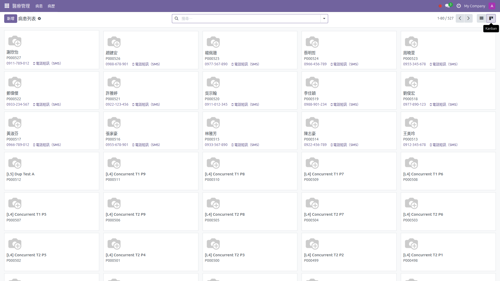
*看板卡片顯示病患頭像、姓名、醫療編號和聯絡資訊。*

### 病患表單 — 基本資料
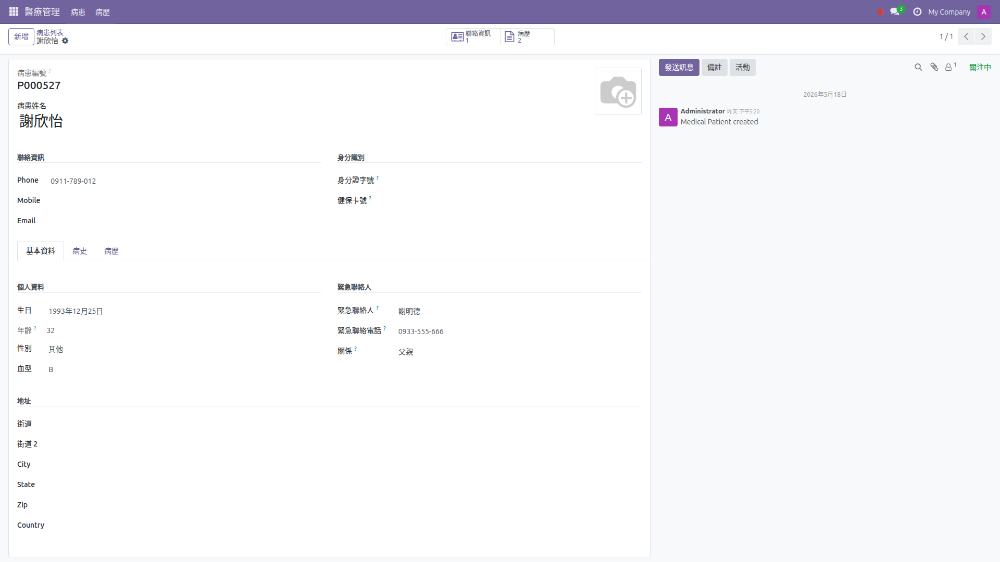
*病患表單含聯絡資訊、身分識別（個資）欄位、個人資料分頁（出生日期、性別、血型）和緊急聯絡人區塊。*

### 病患表單 — 病史

*病史分頁顯示過敏、慢性病、用藥史和手術史欄位。*

### 病患表單 — 病歷與統計按鈕

*病患表單顯示病歷分頁，含嵌入式病歷列表和標題列中的統計按鈕。*

### 病歷列表視圖
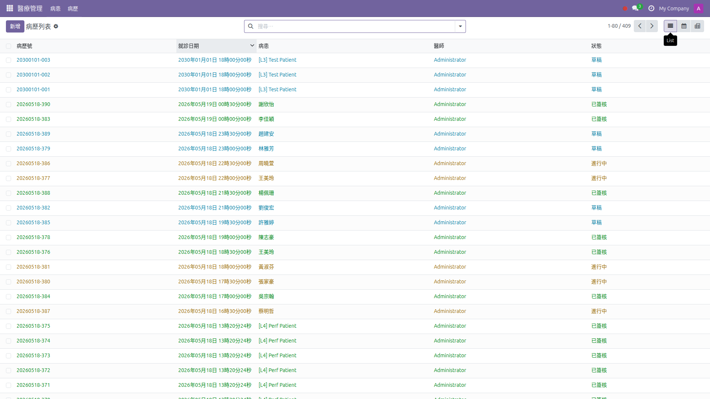
*病歷列表含病歷編號、病患姓名、醫師、就診日期和顏色標記的狀態。*

### 病歷表單 — SOAP

*病歷表單顯示 SOAP 分頁（S/O/A/P）、三階段工作流程列（草稿 → 進行中 → 已簽核）和討論區。*

### 病歷表單 — 生命徵象
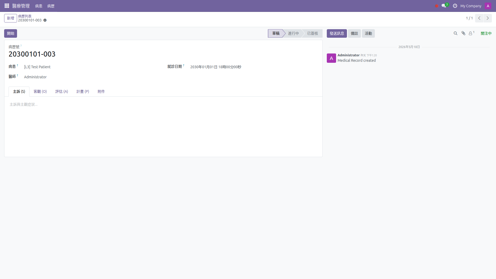
*客觀（O）分頁含生命徵象欄位：身高、體重、血壓、脈搏和體溫。*

### 病歷日曆視圖
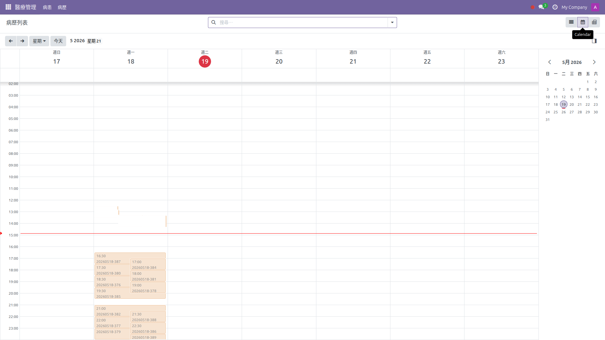
*日曆視圖將病歷顯示為事件，方便排程和預約總覽。*

### 設定 — 存取權限
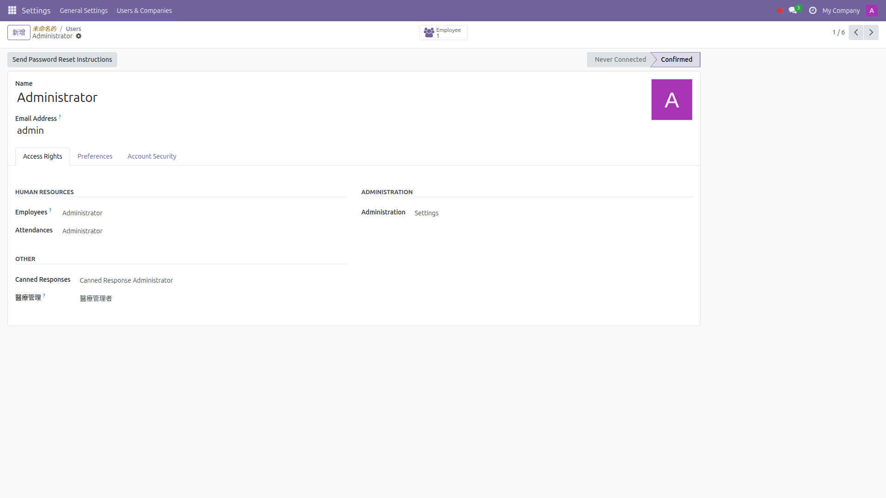
*在設定中的使用者表單顯示存取權限分頁中的醫療權限下拉選單。*

### 首頁選單
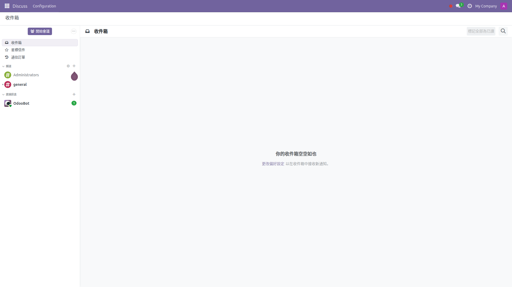
*Odoo 首頁選單顯示醫療管理應用程式圖示。*

### 模組圖示


### 稽核日誌
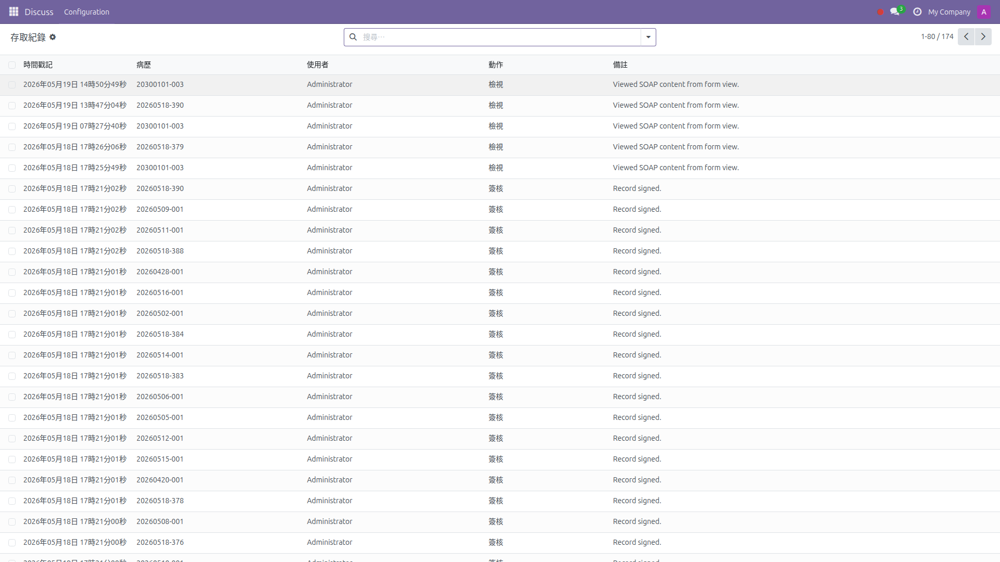
*不可變更的存取日誌，記錄病歷的每次檢視、簽核和取消簽核操作。*

---

## 快速開始

### 前置需求

- Docker & Docker Compose
- Git

### 步驟

```bash
# 1. 複製倉庫
git clone https://github.com/WOOWTECH/Woow_odoo_clinic_package.git
cd Woow_odoo_clinic_package

# 2. 啟動服務
docker compose up -d

# 3. 存取 Odoo
#    網址：    http://localhost:9103
#    帳號：    admin
#    密碼：    admin

# 4. 透過 Odoo 應用程式選單安裝模組：
#    - 搜尋 "Medical" 或 "Woow"
#    - 先安裝「Woow 醫療 - 病患管理」
#    - 再安裝「Woow 醫療 - 病歷管理」
```

---

## 安裝方式

### 手動安裝（不使用 Docker）

1. 將 `woow_medical_patient` 和 `woow_medical_record` 複製到 Odoo addons 路徑
2. 重啟 Odoo 伺服器
3. 前往 **應用程式** → **更新應用程式列表**
4. 搜尋 "Woow" 並先安裝 **Woow 醫療 - 病患管理**
5. 再安裝 **Woow 醫療 - 病歷管理**

> **注意：** `woow_medical_record` 相依於 `woow_medical_patient`，請先安裝病患模組。

### Docker 環境詳情

| 服務 | 映像檔 | 連接埠 | 認證資訊 |
|------|--------|--------|----------|
| PostgreSQL | postgres:16 | 5432（內部） | `odooclinic` / `odooclinic` |
| Odoo 18 | odoo:18 | 9103 → 8069 | `admin` / `admin` |

---

## 系統設定

### 資料庫

預設 Docker 設定使用：
- **資料庫名稱：** `odoo-clinic`
- **資料庫使用者：** `odooclinic`
- **設定檔：** `config/odoo.conf`

### 多公司

兩個模組皆支援多公司隔離。各公司的資料透過全域記錄規則自動分離。啟用多公司：

1. 前往 **設定** → **一般設定** → 啟用 **多公司**
2. 建立額外的公司
3. 將使用者分配到各自的公司

### 使用者群組指派

1. 前往 **設定** → **使用者與公司** → **使用者**
2. 選擇使用者並開啟 **存取權限** 分頁
3. 捲動到 **其他** 區塊
4. 將 **醫療管理** 下拉選單設定為適當的角色：
   - **醫療使用者** — 櫃檯人員、護理師（讀取病患、讀取病歷）
   - **醫療醫師** — 醫師（建立/編輯病歷、簽核病歷）
   - **醫療管理者** — 完整權限，包含稽核日誌

---

## 安全模型

### 權限矩陣

| 群組 | 病患 | 病歷 | 存取日誌 |
|------|------|------|----------|
| 醫療使用者 | 讀取、寫入、建立 | 僅讀取 | 僅建立 |
| 醫療醫師 | 讀取、寫入、建立 | 讀取、寫入、建立 | 僅建立 |
| 醫療管理者 | 讀取、寫入、建立、刪除 | 讀取、寫入、建立 | 讀取、建立 |

### 記錄規則

| 規則 | 範圍 | 說明 |
|------|------|------|
| 醫師個人病歷 | `medical.record` | 醫師僅能查看自己的病歷 |
| 管理者所有病歷 | `medical.record` | 管理者可查看公司內所有病歷 |
| 多公司隔離 | 全域 | 記錄依公司隔離 |

### 個資保護

身分證字號（`national_id`）和健保卡號（`nhi_card_no`）為敏感個人資料。這些欄位的存取透過安全模型控管，確保僅授權使用者能夠查看病患身分文件。

---

## 測試

本專案包含完整的多層測試套件：

| 層級 | 檔案 | 測試重點 |
|------|------|----------|
| 第 1 層 | `tests/layer1_api.py` | API/後端 — JSON-RPC CRUD 操作 |
| 第 2 層 | `tests/layer2_e2e.js` | 端對端 — 瀏覽器工作流程測試 |
| 第 3 層 | `tests/layer3_negative.py` | 負面測試 — 錯誤路徑與安全邊界 |
| 第 4 層 | `tests/layer4_performance.py` | 效能測試 — 負載與壓力測試 |
| 第 5 層 | `tests/layer5_integrity.py` | 完整性 — 資料一致性與限制條件 |
| E2E 權限 | `tests/e2e-permissions/` | Playwright — 存取權限下拉選單、個資可見性、權限升降 |
| 驗收測試 | `test_acceptance.py` | 冒煙測試 — 端對端驗收驗證 |

### 執行測試

```bash
# 執行所有測試層
python3 tests/run_all.py

# 執行特定層
python3 tests/layer1_api.py

# 執行驗收測試
python3 test_acceptance.py

# 執行 Playwright 權限測試
cd tests/e2e-permissions
npm install
npx playwright test
```

---

## 國際化

兩個模組皆包含完整的繁體中文（zh_TW）翻譯：

- **woow_medical_patient:** `i18n/zh_TW.po`
- **woow_medical_record:** `i18n/zh_TW.po`

啟用中文：

1. 前往 **設定** → **一般設定** → **語言**
2. 新增 **繁體中文** （如尚未啟用）
3. 每位使用者可在 **偏好設定** 中設定自己的語言

所有標籤、選單、欄位名稱、提示訊息均已翻譯。技術術語和程式碼維持英文。

---

## 更新日誌

### v18.0.1.0.0（2025-05）

- 首次發行
- 病患管理含自動編號與 `res.partner` 委派繼承
- SOAP 病歷含每日編號與三階段工作流程
- 不可變更的存取稽核日誌
- 角色權限控管（3 層階層群組 + 個資保護）
- 多公司支援與全域記錄規則
- 繁體中文（zh_TW）完整翻譯
- Docker Compose 部署（PostgreSQL 16 + Odoo 18）
- 多層自動化測試套件（5 層 + Playwright E2E）

---

## 技術支援

- **官方網站：** [https://www.woowtech.io](https://www.woowtech.io)
- **問題回報：** [https://github.com/WOOWTECH/Woow_odoo_clinic_package/issues](https://github.com/WOOWTECH/Woow_odoo_clinic_package/issues)
- **作者：** WoowTech

---

## 授權條款

本專案採用 [LGPL-3.0](https://www.gnu.org/licenses/lgpl-3.0.html) 授權。

Copyright &copy; 2025 WoowTech
